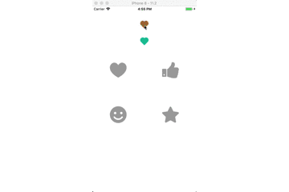

# XCAnimationButton

[](https://travis-ci.org/fanxiaocong/XCPresentation)
[](https://cocoapods.org/pods/XCAnimationButton)
[](https://cocoapods.org/pods/XCAnimationButton)
[](https://cocoapods.org/pods/XCPresentation)
[](https://www.apple.com/nl/ios/)&nbsp;


***
|Author|小小聪明屋|
|---|---|
|E-mail|1016697223@qq.com|
|GitHub|https://github.com/fanxiaocong|
|Blog|http://www.cnblogs.com/fanxiaocong|
***

## Example
动画按钮，支持代码和XIB方式创建。


### 效果图


### 代码
```objc
- (void)setupUI
{
    NSArray *images = @[@"heart", @"like", @"smile", @"star"];
    
    CGFloat buttonWH = 60;
    CGFloat screenW = [UIScreen mainScreen].bounds.size.width;
    
    for (NSInteger i = 0; i < images.count; i ++)
    {
        CGFloat buttonX = screenW * 0.5 * (i % 2) + (screenW * 0.5 - buttonWH) * 0.5 ;
        CGFloat buttonY = 200 + (buttonWH + 100) * (i / 2);
        
        XCAnimationButton *button = [[XCAnimationButton alloc] initWithFrame:CGRectMake(buttonX, buttonY, buttonWH, buttonWH)];
        /// 背景图片
        button.image = [UIImage imageNamed:images[i]];
        /// 最终填充的按钮的颜色
        button.favoredColor = [UIColor redColor];
        /// 默认的背景颜色
        button.defaultColor = [UIColor lightGrayColor];
        /// 渐变环的颜色
        button.circleColor  = [UIColor orangeColor];
        /// 线的颜色
        button.lineColor    = [UIColor blueColor];
        /// 状态改变一次的时间
        button.duration     = 1.f;

        [button addTarget:self action:@selector(didClickButton:) forControlEvents:UIControlEventTouchUpInside];
        
        [self.view addSubview:button];
    }
    
    [self.smailButton addTarget:self action:@selector(didClickButton:) forControlEvents:UIControlEventTouchUpInside];
}

#pragma mark - 🎬 👀 Action Method 👀

- (void)didClickButton:(XCAnimationButton *)button
{
    /*⏰ ----- 此处刻要刻改变按钮的选中状态: 如果不改变选中状态, 是没有动画效果的 !!! ----- ⏰*/
    button.selected = !button.isSelected;
}

```


## Installation

### CocoaPods
```objc
pod 'XCAnimationButton'
```


